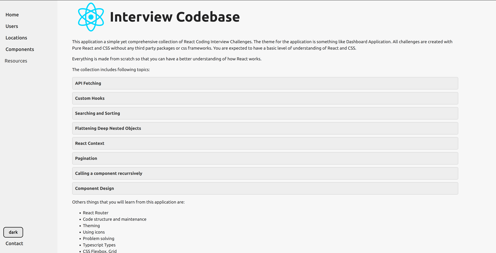
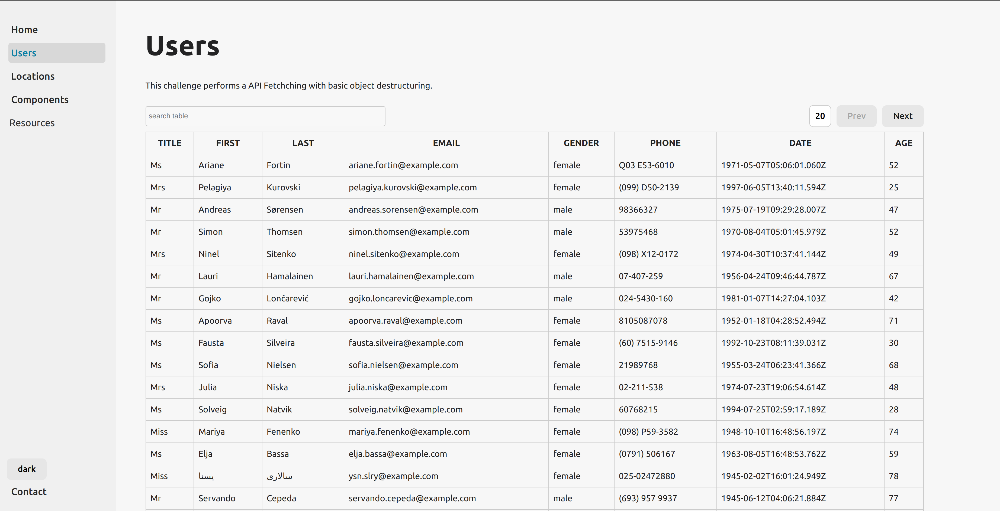
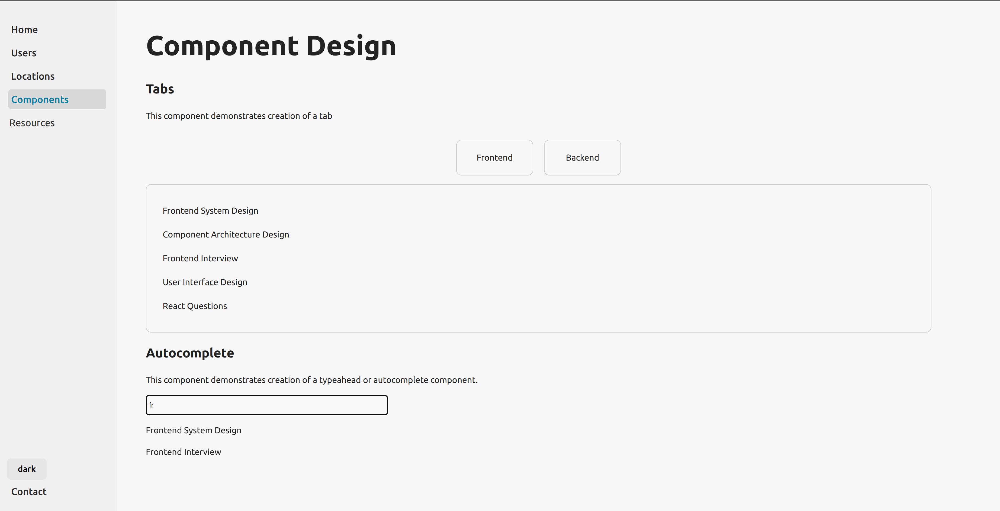

# React Interview Codebase

A respository for Frontend Engineers consisting of popular interview questions solved using Pure React and CSS.
The goal is to make things like Component Design, Machine coding, Pure React Coding, state management and styling easier to understand.
Simple yet comprehensive codebase to make you ready for your next Frontend Interiew.

View the application at: https://neutr0nian.github.io/react-interview-codebase/
⭐ Star it, if you like it!

### Things you'll learn

1. Modular Design
2. Reusing Components
3. Fetching Techniques
4. Optmizations
5. Typescript React
6. CSS styling, animations
7. Logic building
8. Problem solving
9. React Concepts (Props, Context, Routing, Components)
10. Javascript Concepts (Destructuring, Nested Objects, Polyfills)

## How to make the best out of it?

1. Clone the application
2. Go throught the each page and understand the components on each page.
3. To figure out the working of a component, navigate to a particular page and component in the codebase.
4. Understand the logic, resusability and modular design of the code.
5. Implement your own version or improve the current one.
6. Make a Pull request to contribute (Optional)

### Components designed

1. Table
2. Accordian
3. Tabs
4. Search
5. Sorting
6. Sidebar
7. Pagination
8. Typeahead

### Setup

1. Clone the repository
2. Change the HashRouter to BrowserRouter (Optional)
3. npm run dev
4. Visit the location hosted
5. Enjoy!

#### Suggestion

Build your own versions, add other components and make it available so that others can make use and get help.
